# 1. Архитектура компьютерных систем

## Архитектура компьютерных систем

Две мейнстримных архитектуры:

### Гарвардская
- отельное устройство - Control Unit (в центре системы)
- отдельное устройство - ALU (арифметико-логическое устройство(а))
- раздельная память для инструкций и для данных

### фон Неймановская:
- Control Unit и ALU объеденены в CPU
- общая память для инструкций и для данных

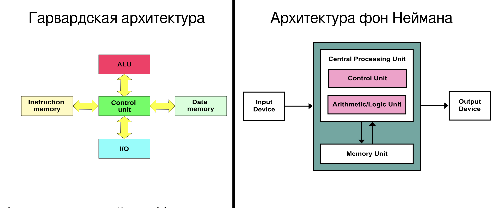

Основные принципы архитектуры фон Неймана:
- Принцип однородности памяти. Команды и данные хранятся в одной и той же памяти (внешне неразличимы). P.S. конечно может быть (обычно есть) разделение на сегменты, но оно относительно условное.
- Принцип адресности. Память состоит из пронумерованных ячеек, процессору доступна любая ячейка.
- Принцип программного управления. Вычисления представлены в виде программы, состоящей из последовательностей команд.
- Принцип двоичного кодировния. Вся информация, как данные так и команды, кодируются двоичными цифрами 0 и 1.

## Архитектуры UMA/NUMA

### UMA (Uniform memory access):

Суть в том, что все процессоры и вообще все устройства подключены к общей шине. Все устройства имеют доступ к памяти через общую шину и это время доступа у всех одинаково (устройства "одноранговые" - у каждого устройства (cpu, контроллера...) доступ к памяти одинаковый (задержка и тд)).

Основной плюс это как раз одноранговость устройств . Такая архитектура в среднем работает хорошо для 4х процессоров (вычислительных блоков). Дальше увеличивать количество процессоров не имеет смысла:
- когда один процессор обращается к банку памяти, этот банк блокируется, и другим процессорам приходится ждать
- более того, когда один процессор вообще обращается куда-то по системной шине, вся шина блокируется, и другим приходится ждать. (Системная шина - узкое место).

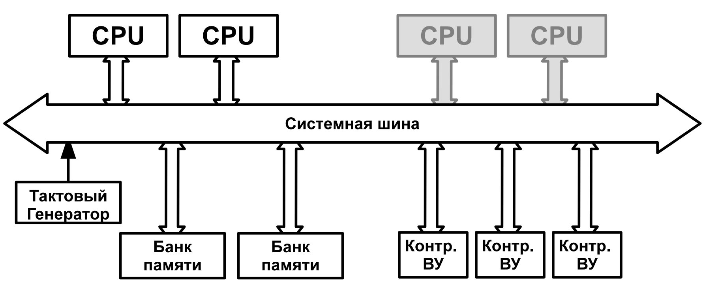

### NUMA (Non-uniform memory access):

Во первых, вместро системной шины - коммутатор. Его фишка в том, что две пары независимых портов могут передавать данные параллельно, и процессом не приходится ждать друг друга (каждый порт может общаться с каждым). То есть, коммутатор не блокируется, как только одному процессору нужно обратиться куда-то к другому устройству.

Но это не главное. Количество таких обращений в принципе сведено к минимуму. К коммутатору теперь подключается большое количество системных плат, где каждая из которых практически самодостаточна. Например на системной плате может быть несколько процессоров, у каждого свой кэш первого уровня, и попарно общий кэш второго уровня (например), и несколько банков памяти.

Тем не менее, адресное пространство для всей системы общее, то есть, при надобности процессор может сходить через коммутатор на другую системную плату, чтобы воспользоваться дополнительной памятью. Ну или к устройству ввода-вывода через коммутатор тоже. Но все таки нужно понимать, что доступ к памяти, расположенной локально будет быстрее, чем ходить в другой банк через коммутатор, поэтому, по возможности, операционная система должна пытаться размещать данные необходимые процессу локально на системной плате.

Более того, такая архитектура предоставляет возможность "на горячую" менять элементы. Например, даем команду, чтобы все процессы мигрировали с какой-то системной платы на другие, отключаем плату, заменям процессор, вставляем обратно, процессы перераспределяются.

И по итогу за счет локальности (в лучшем случае) данных на каждой системной плате + наличие кэшей (в UMA кэши тоже есть конечно, но все же) получается увеличить количество процессоров в системе.

Единственное, операционная система должна уметь реализовывать все возможности данной архитектуры (миграция процессов туда сюда, правильное размещение памяти и тд)

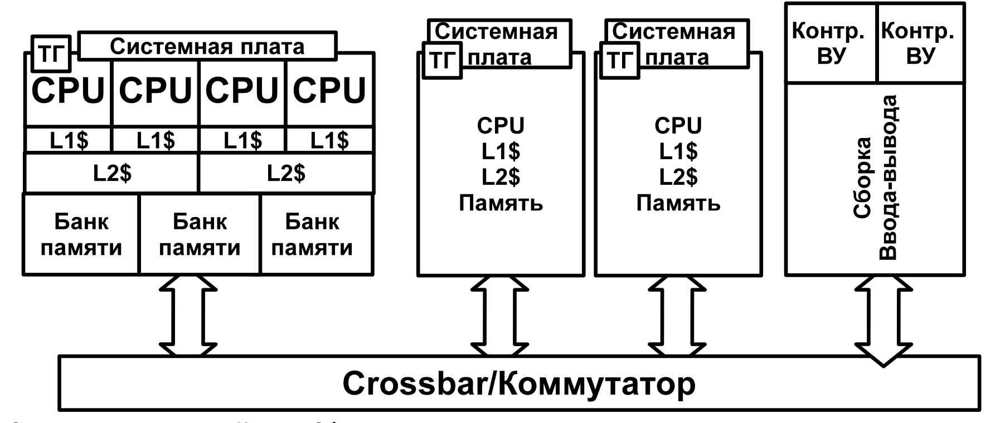

# 2. Обзор компьютерных систем

## Основные элементы

На верхнем уровне компьютер состоит из <u>**процессора**</u>, <u>**памяти**</u>, <u>**устройств ввода-вывода**</u> и <u>**системной шины**</u>, которая обеспечивает взаимодействие между этими компонентами.

### Процессор

Управляет всеми действиями компьютера а также выполняет функцию обработки данных. Если в системе есть только один процессор, он обычно называется <u>**центральным процессором**</u> (central processing unit - CPU).

### Основная память

В ней хранятся данные и программы (архитектура фон Неймана). Эта память
является временной, т.е. при выключении компьютера ее содержимое теряется.
( Содержимое же дисковой памяти, напротив, сохраняется даже при выключении
компьютерной системы). Часто основную память называют <u>**реальной, оперативной или первичной памятью**</u> (постоянная память - <u>**вторичная**</u>).

### Устройства ввода-вывода

Служат для передачи данных между компьютером и внешним миром: это различные периферийные устройства в число входят вторичная память (например, диски), коммуникационное оборудование и терминалы.

### Системная шина

Обеспечивает взаимодействие между процессором, основной памятью и устройствами ввода-вывода


## Организация вычислений

Программа, которую выполняет процессор состоит из последовательности команд, которые процессор умеет как-то интерпретировать.

Выполнение любой программы сводится к повторению одного и того же цикла. Процессор постоянно делает:
- выбрать следующую команду из памяти
- выполнить команду
- повторить

Каждая команда представляет собой закодированное действие, которое процессор должен выполнить. Эти действия могут относиться к нескольким типам операций:

- взаимодействие процессора с памятью (чтение или запись данных),
- взаимодействие процессора с устройствами ввода-вывода,
- обработка данных (арифметические или логические операции),
- управление выполнением программы (например, переходы и изменение порядка выполнения команд).

Для выполнения одной команды процессору обычно требуется несколько последовательных этапов, которые вместе образуют <u>**цикл команды**</u>:
- **Выборка команды (Instruction Fetch)**
Процессор по адресу, хранящемуся в счётчике команд, обращается к памяти и считывает следующую инструкцию.
- **Декодирование инструкции (Instruction Decode)**
На этом этапе процессор анализирует код операции и определяет, какое действие требуется выполнить и какие операнды для этого нужны.
- **Исполнение (Execution)**
Процессор выполняет требуемую операцию — например, арифметическое вычисление, сравнение или подготовку адреса памяти.
- **Доступ к памяти (MEM)**
Если операция связана с памятью, может происходить этап доступа к памяти — например, чтение данных из памяти или запись результата.
- **Запись результата (Write Back)**
В конце выполняется этап записи результата, когда полученный результат записывается в регистр процессора или в память.

После завершения этих этапов команда считается выполненной, счётчик команд обновляется, и процессор снова начинает цикл — выбирает следующую инструкцию из памяти.

### Пример 1:
```
LOAD R1, [A]
```
- Fetch
процессор читает команду из памяти

- Decode
понимает: нужно загрузить данные

- Execute
вычисляет адрес A (или эффективный адрес)

- MEM
читает данные из памяти по адресу A

- Write Back
записывает данные в регистр R1

### Пример 2:
```
STORE R1, [A]
```
- Fetch

- Decode

- Execute — вычисляем адрес

- MEM — запись в память

- Write Back — нет действия

### Пример 3:
```
STORE R1, [A]
```
- Fetch

- Decode

- Execute — ALU делает сложение

- MEM — ничего не делает

- Write Back — запись результата в R1

###

Но нужно понимать, что современные процессоры в чистом виде не выполняют команды вот так последовательно - это слишком медленно. Можно многими способами достичь параллелизма, один из фундаментальных вариантов, который сейчас есть почти везде это **конвейер**

Я про него в целом все знаю, так что вот картинка:

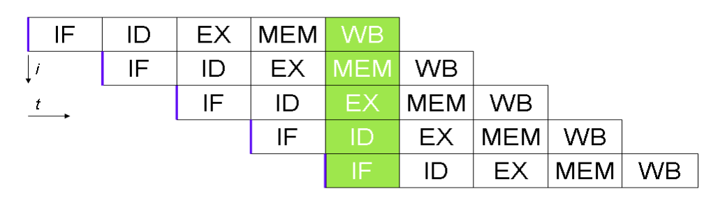

## Прерывания

Прерывание — это событие, которое заставляет процессор прервать текущую программу и перейти к обработчику в ядре.

Общий механизм:
- процессор выполняет программу
- происходит событие
- CPU сохраняет состояние (PC, регистры)
- переключается в режим ядра
- запускает обработчик прерывания
- затем возвращается назад

Прерывания бывают на:
- **синхронные**
Это прерывания, возникающие строго из-за выполняемой прямо сейчас инструкции.
- **асинхронные**
Асинхронные происходят независимо от текущей инструкции. Их инициирует внешнее устройство.

Примеры синхронных прерываний:
- деление на ноль
- обращение к несуществующей странице
- недопустимая инструкция
- системный вызов

Примеры асинхронных прерываний:
- пришёл сетевой пакет
- нажата клавиша
- завершилось чтение диска
- сработал таймер

Обработка асинхронных прерываний происходит в конце цикла команды: после исполнения команды, процессор проверяет не установлен ли соответствующий бит (IRQ - interruption request)

Обработка синхронных прерываний происходит сразу в момент возникновения исключения (например при делении на 0, перед делением процессор проверяет операнд, если он 0 - то сразу прерывание).

<u>**Trap**</u> — это исключение, которое происходит намеренно. Характерный пример - syscall.

Сначала происходит переход в режим ядра, а только потом уже в стек ядра сохраняется текущий контекст и кладется стек возврата.

### Множественные прерывания

Есть несколько способов обрабатывать множественные прерывания:
- запретить прерывания во время обработки прерывания
- разрешить все прерывания (каждое новое будет прерывать текущее)
- ввести приоритеты прерываний
Например прерывание от сетевой карты может быть приоритетнее прерывания принтера, а у диска например, будет прерывание с таким же приоритетом как у принтера (сетевая карта - 2, диск - 1, принтер - 1). И тогда, если при выполнении пользовательской программы:
  - пришло прерывание от диска -> начинается обработка прерывания
  - потом пришло прерывание от принтера (предположим, что вообще у принтера даже меньше приоритет для наглядности) -> ничего не происходит
  - пришло прерывание от сетевой карты -> прерывание от диска прерывается, начинается обработка прерывания от сетевой карты
  - прерывание от сетевой карты обработалось -> продолжается обработка прерывания диска
  - прерывание от диска обработалось -> начнется обработка прерывания от принтера.
Это может иметь место быть, например, так как пакеты в сетевую карту приходят асинхронно и ее буфер может переполниться. В таком случае данные пропадут. А принтеру или диску вообще всё равно.

TODO контроллер прерывания

## Пирамида памяти

Запоминающие устройства характеризуются объемом, быстродействием и стоимостью. На любом этапе развития запоминающих устройств соблюдаются следующие достаточно устойчивые соотношения:
- чем меньше время доступа, тем дороже каждый бит
- чем выше емкость, тем ниже стоимость бита
- чем выше емкость, больше время доступа

Иерархия запоминающих устройств:
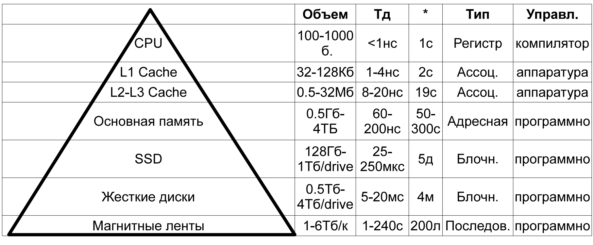

При спуске к основанию пирамиды происходит следующее:
- снижается стоимость бита
- возрастает емкость
- возрастает время доступа
- снижается частота обращений процессора к памяти

Время доступа - время от того, как были выданы какие-то первые сигналы на то, чтобы получить что-то из памяти до того как первые данные начали поступать.

## Кеш

Идея кеша опирается на принцип пространственной и временной локальности.

<u>**Пространственная локальность**</u> - Если программа обратилась к некоторому адресу памяти, велика вероятность, что скоро она обратится к соседним адресам.

<u>**Временная локальность**</u> - Если программа обратилась к некоторому адресу памяти, велика вероятность, что скоро она обратится к нему снова.

Рассматривается система с одним кешем. Память разделена на блоки фиксированного размера (непонятно так ли это на самом деле или просто так рассматривается, или может быть для памяти это разделение условно)

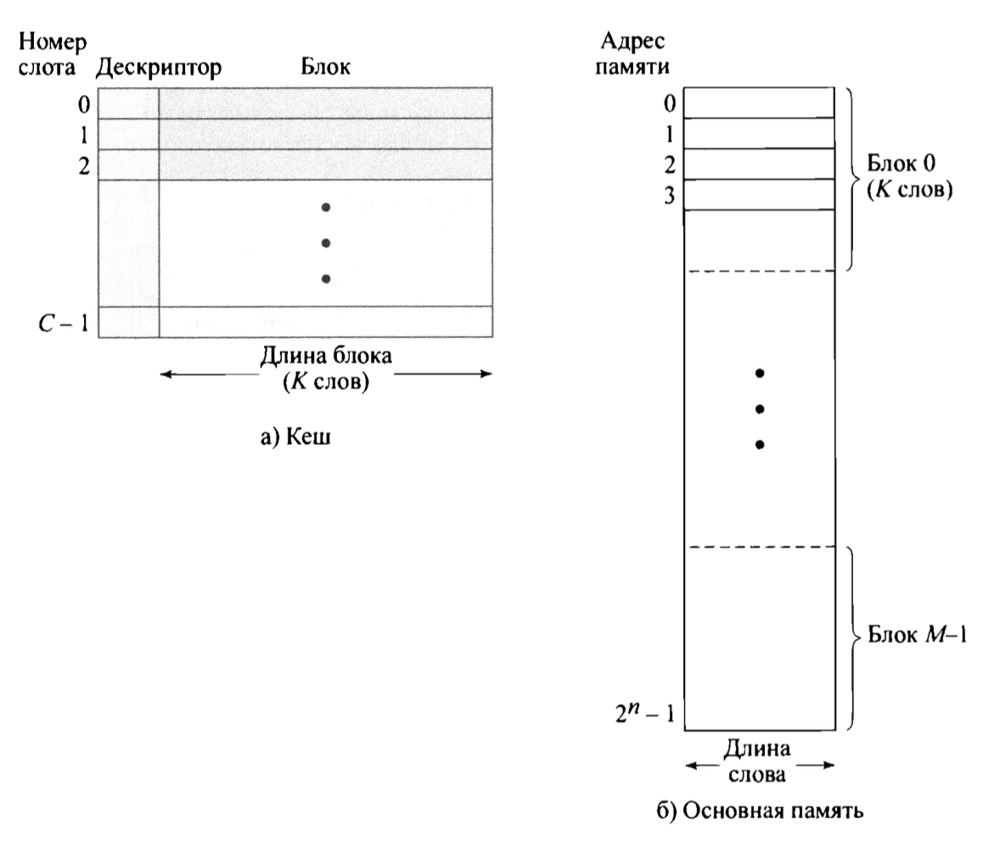

Итак, каждый блок в памяти фиксированного размера - K, кеш меньшей емкостью, количество записей в кеше - C. Каждая запись в кеше размером в один блок памяти. Поскольку объем кеша меньше, он может содержать только фиксированное небольшое количство блоков памяти. Чтобы идентифицировать блок памяти используется какое-то количество старших бит адреса (полагаю, что это количество бит зависит от размера самого блока и от количества этих блоков). То есть если размер блока - 4, то адреса будут идти так:
```
0000
0001
0010
0011
0100

0101
0110
...
```

то есть каждые 4 адреса старшие биты начиная со 2го (нумерация с 0) будут менять свои значения. А количество старших бит со 2го и старше определяет соответсвенно количество блоков, думаю это понятно. В данном случае 2 бита => 4 блока => 4 * 4 = 16 ячеек. Вот эти старшие два бита будут использованы в качестве дескриптора (см. рисунок).

Итак, если процессор обращается к какому-то адресу XXZZ, то если строка с дескриптором XX есть в кеше, то данные берутся оттуда, если нет в кеше, то блок XX загружается из памяти и заменяет какой-то блок в соответствии с выбранной стратегией.

P.S. Обычно адрес указывает на байт а не на слово, но выбирается целиком слово начиная с этого байта

## ПДП (DMA)

Существует три основных метода выполнения операций ввода-вывода:
- **программируемый ввод-вывод**
Когда процессору встречается команда ввода-вывода, он выполняет сисколл с определенными параметрами, драйвер как-то взаимодействует с контроллером и в какой-то момент начинает ждать, пока уже само устройство отработает. При программируемом вводе-выводе ожидание ВУ неблокирующее, то есть сисколл возвращается в юзерспейс и, когда устройство отработает, будут установлены соответствующие биты в регистрах состояния ввода-вывода. Процессор же в это время занят тем, что в спин лупе проверяет эти регистры состояния, что не очень эффективно.
- **ввод-вывод с использованием прерываний**
Тут процессор все так же сначала делает неблокирующий (или же блокирующий) сискол, после чего может продолжать выполнять текущую задачу, если данные от ВУ не требуются для дальнейшего выполнения (тут неблокирующий будет), или же дать выполниться другой задаче (тут блокирующий). Когда ВУ отработает, контроллером будет сгенерировано прерывание, обработчик этого прерывания вызовет какие-то процедуры драйвера, данные покопируются куда-нибудь если надо и процесс, который ждал эти данные будет "пробужден" (или не будет, если он не был заблокирован).
- **прямой доступ к памяти**
Даже несмотря на то, что, вроде как использование прерываний делает ввод-вывод достаточно эффективным, все равно процессорное время в достаточном количестве затрачивается на работу драйвера (копирование данных и тд). Поэтому, особенно при передачи большого количества данных используется DMA контроллер. Это вычислительный блок, которым управляет процессор непосредственно только в начале и в конце работы: устанавливает параметры, делает свои дела, в это время контроллер DMA сам все покопировал в память из ву (или наоборот), и как отработал, сгенерировал прерывание

## Организация многопроцессорных и многоядерных систем

### SMT
Симметричное мультипроцессирование. Идея в том, что у нас не один центральный процессор а несколько и они одинаковые.

Поэтому, по сравнению с системами с одним центральным процессором, могут быть некоторые потенциальные приемущества:
- производительность - если задача, которую выполняет компьютер может быть организована так, что некоторые части могут быть выполнены параллельно, то система с количеством процессоров больше одного даст большую производительность
- надежность - если один процессор из строя, то потенциально система все равно может продолжить работу, используя другие процессоры
- инкрементальный рост - потенциально всегда можно повысить производительность путем добавления еще одного процессора
- масштабирование - можно делать много разнообразных компьютерных систем от дешевых и относительно непроизводительных с меньшим количеством процессоров, до дорогих и производительных с большим количеством процессоров

### ASMP
Ассиметричное мультипроцессирование. Отношение например как CPU - GPU. Или наверное как раз как CPU - DMA.

# 3. Обзор операционных систем

Операционная система - это программа, контролирующая выполнение прикладных программ и исполняющая роль интерфейса между приложениями и аппаратным обеспечением компьютера.

## Цели и функции ОС

### ОС как интерфейс между пользователем и компьютером

Краткий список услуг, предоставляемых типичными операционными системами:

- Разработка программ
ОС предоставляет инструменты разработки прикладных программ (редакторы, отладчики, компиляторы). Они находятся в юзерспейсе, но можно считать их частью ОС.
- Выполнение программ
ОС занимается "грязной работой", которую раньше выполнял оператор: загрузка программы в основную память, инициализация устройств ввода-вывода, подготовка других ресурсов и тд.
- Доступ к устройствам ввода-вывода
Для управления работой каждого устройства ввода-вывода нужен свой особоый набор команд или контрольных сигналов. Операционная система предоставляет программисту единообразный интерфейс, который скрывает все эти детали.
- Контролируемый доступ к файлам
При работе с файломи мало того, что нужно уметь работать с устройствами ввода-вывода, но еще и расшифровать данные на носителе, чтобы превратить их в файловую систему (я так понял смысл в том, что например на диске в начале блока данных лежат какие-то метаданные, в конце тоже какие-то метаданные, еще где-то метаданные говорящие о том что это такой то файл такого-то размера и тд). Если бы мы читали "сырые" данные с диска, и пытались с ними работать, то наверное это было бы тяжело. Сюда же можно отнести и права доступа всякие.
- Системный доступ
ОС управляет доступом к совместноиспользуемой (хотя необязательно) вычислительной системе в целом, а так же к отдельным файлам и тд. Авторизация, аутентификация и все такое.
- Обнаружение ошибок и их обработка
При работе вычислительной системы могут возникать различного рода ошибки: аппаратные или программные. Операционная система должна уметь их обрабатывать.
- Учет использования ресурсов
Может быть с первого взгляда кажется неважным, но хорошая ОС должна иметь средства учета использования различных ресурсов и отображения параметров производительности. Эта информация может использоваться для дальнейших улучшений и настройки вычислительной системы для повышения ее производительности. В многопользовательских ОС эта информация может применяться для выставления счетов.

Сюда же, но хочется отдельно выделить:
- ISA (Instruction Set Architecture)
Набор команд процессора. Пользовательским программам и утилитам ОС предоставляет доступ лишь к подмножеству команд (пользовательская ISA). ОС имеет доступ к дополнительным командам, которые относятся к управления ресурсами системы (системная ISA).
- ABI (Application Binary Interface)
Это по сути как low-level api. API на уровне команд процессора. ABI определяет, например, как выполняются системные вызовы (в какой регистр положить номер сисколла, в какой регистр первый аргумент и тд), как передаются аргументы функций, где будет лежать результат работы функции (возвращаемое значение) и тд. То есть по сути: по каким правилам исполоьзовать ISA. Определяет бинарную совместимость(программа скомпилированная под конкретный ABI будет работать и на другой системе с тем же ABI)
- API (Application Programming Interface)
Это стандартный набор библиотечных функций, через которые программа обращается к возможностям ОС. Обертки над сисколлами и тд. Например libc или POSIX API. Переносимость обеспечивается путем перекомпиляции на другую систему, где есть те же библиотеки.

### Операционная система как диспетчер ресурсов

ОС управляет ресурсами компьютера такими как процессорное время, ввод-вывод, основная и вторичная память и тд. Управляющий механиз в ОС осуществлен не как "демон", который работает где-то отдельно и следит за системой. Операционная система работает не всегда, иногда она должна передавать процессор другим "полезным" задачам, а затем возобновляет контроль ровно настолько, чтобы подготовить процессор к следующей части работы.

## Эволюция операционных систем

Пытаясь понять основные требования, предъявляемые к операционным системам, а также значение основных возможностей современных операционных систем, полезно проследить за их эволюцией, происходившей на протяжении многих лет.

### Последовательная обработка

В первых вычислительных системах операционных систем еще не было, программисту приходилось взаимодействовать непосредственно с программным обеспечением. Эти компьютеры управлялись с пульта управления, где были всякие тумблеры, кнопочки и тд (как в БЭВМ). Программы загружались через устройство ввода данных (например устройство ввода с перфокарт). Если во время исполнения программы происходила ошибка, то загорались определенные индикаторы и программисту приходилось смотреть непосредственно на регистры и состояние памяти, чтобы понять что случилось. Если программа успешно завершала свою работу, то выходные данные распечатывались на принтере. Такие системы имели две основные проблемы:
- расписание работы
На таких системах нужно было "записываться" на определенное время. Программисту выделялся условный час, в который он мог прийти и поработать с компьютером.
- время подготовки к работе
Для запуска каждой программы (называлась задачей (job)), программисту нужно было загрузить в память компилятор и саму программу, обычно составленную на языке высокого уровня (относительно, конечно, например fortrun), скомпилировать программу, загрузить библиотечный код, скомпоновать все вместе. Чтобы все это сделать нужно каждый раз загружать колоду перфокарт и тд, короче это все очень долго. И если вдруг по итогу возникала ошибка, приходилось делать все заново.

Такой режим работы назывался <u>**последовательной обработкой**</u>. Не очень понятно почему конкретно, то ли потому что программы выполняются последовательно (но вообще-то в пакетной обработке тоже), то ли потому что программисты работали по очереди.

### Пакетные системы

Тут уже речь про изобретение первой, можно сказать, операционной системы, которая называлась <u>**системный монитор**</u>. Системный монитор помог автоматизировать часть процессов, и немного сэкономить людям время, и соответственно, использовать машинное время эффективнее.

Идея работы с такими системами заключалась в том, что программисты отдают свои программы оператору (то есть они уже не сами работают за компьютером), который собирает какую-то часть программ в **пакет**, помещает их в устройство ввода данных и нажимает кнопочку.

Задача монитора уже состояла в том, чтобы последовательно извлекать задачи, компилировать их, исполнять, и печатать результаты. Таким образом "за раз" исполнялось сразу несколько программ.

Монитор представлял из себя программу, постоянно находящуюся в освной памяти. В первом приближении он работал так: считывал задачу с устройства ввода, размещал ее в области памяти, предназначенной для программ пользователя, передавал управление программе пользователя, она исполнялась, по завершении программы пользователя управление передавалось обратно монитору, который сразу же приступал к считыванию нового задания.

Если более глубоко: каждая программа помимо самого программного кода содержала команды монитора. То есть в начале задания писалось что-то типа (загрузи компилятор фортрана и скомпилируй программу, описанную ниже). Ну и соответственно монитор сначала загружал с устройства ввода пользовательскую программу, потом загружал компилятор, комилировал программу (скомпилированная программа могла писаться на вторичную память, так как было мало оперативки), если скомпилированная программа была на вторичной памяти, то следующей командой монитора могла быть загрузка скомилированной программы из вторичной памяти. И потом уже монитор передавал управление пользовательской программе. Когда программа заканчивала выполнение или крашилась, управление передавалось обратно монитору. 

Вот такая картинка, правда прерываний по факту еще вроде как не было.

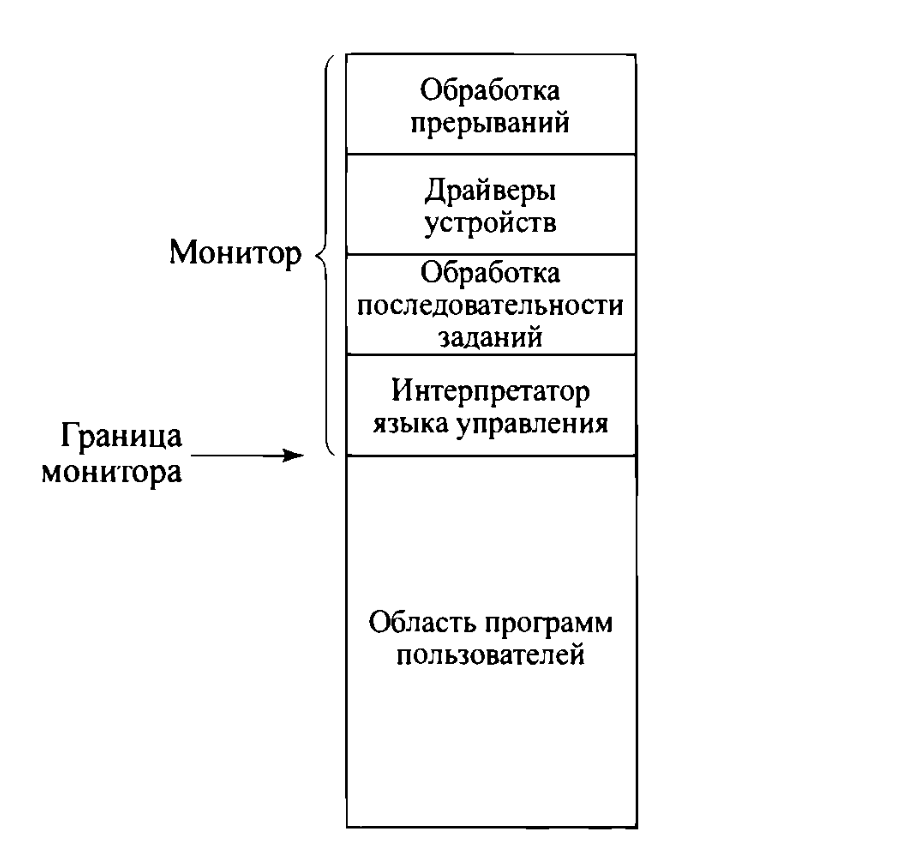

Кстати вот и пользователю уже не приходилось напрямую управлять вводом выводом, появились отдельно выделенные драйверы. (Хотя и до этого может тоже были драйверы).

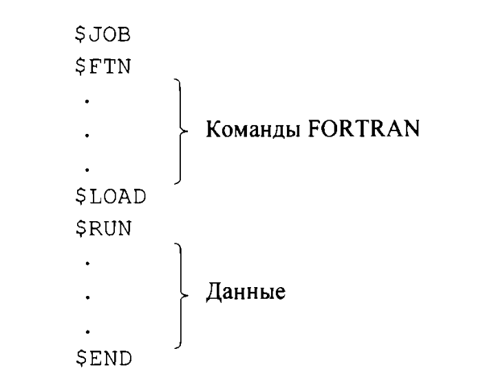

Так же с появлением мониторов возникли первые сложности о которых приходилось думать. В современных операционных системах они тоже имеют место быть.

- Защита памяти
Раз уж монитор тоже лежит в памяти, нужно понимать, что, в теории, неправильная пользовательская программа может попортить сам монитор. По идее процессор должен отлавливать попытки обращения к адресам, не относящиеся к пользовательским и передавать управление монитору, который завершал бы программу и печатал бы ошибку.

- Таймер
Защита от зависания. Прерываний по таймеру еще не изобрели, поэтому возможность того, что пользовательская программа зависнет в каком-нибудь бесконечном цикле надо было регулировать какими-то другими способами. Самое очевидное, просто ограничить выполнение программы пользователя каким-то временем (две минуты например). И по истечении этого времени, управление передавалось монитора и он завершал бы программу и печатал бы ошибку.

- Привилегированные команды
Мы наверное не хотим позволять пользователю делать с системой все что угодно. Драйверы вот вынесли даже в сам монитор итд. Поэтому нужно было явно выделить команды доступные пользователю, а какие-то команды разрешить исполнять только из контекста монитора. Отсюда появляется идея про режим пользователя и режим ядра.

### Многозадачные пакетные системы

Тут уже люди задумываются о том, что время, которое процессор простаивает при выполнении ввода вывода достаточно большой. И при анализе какой-то типовой программы получили ничтожные проценты степени эффективности использования процессора:

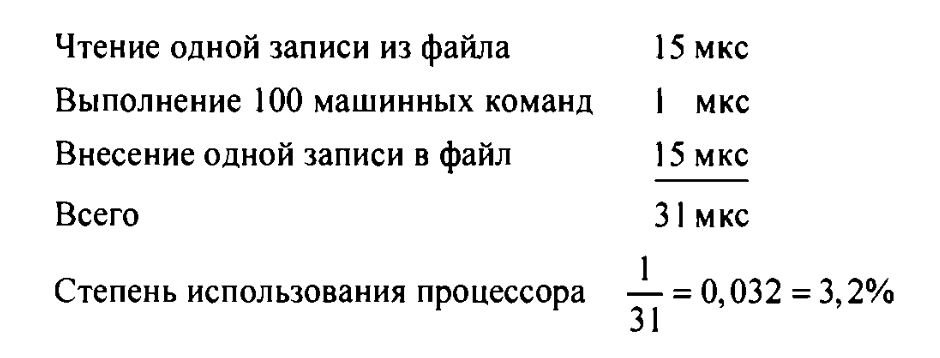

Тогда пришла мысль о том, чтобы передавать управление другой задаче, пока текущая выполняет ввод-вывод. Насколько я понял как раз на этом изобретается ввод вывод с использованием прерываний, и DMA. До этого видимо был ввод-вывод, выполняющийся по схеме: загрузить данные в контроллер внешнего устройства и в цикле проверять закончился ли ввод вывод. По идее и с таким вводом выводом можно было бы попробовать реализовать многозадачность: просто после передаче параметров сразу отдавать управление другой задаче, а когда эта другая задача тоже натыкалась на ввод вывод, например, возвращаться к предыдущей и смотреть че там у нее или идти дальше к следующей задаче и обрабатывать их "по кругу" как бы. Возможно так раньше и делали.

Вот такая картинка, почти как из лекции:
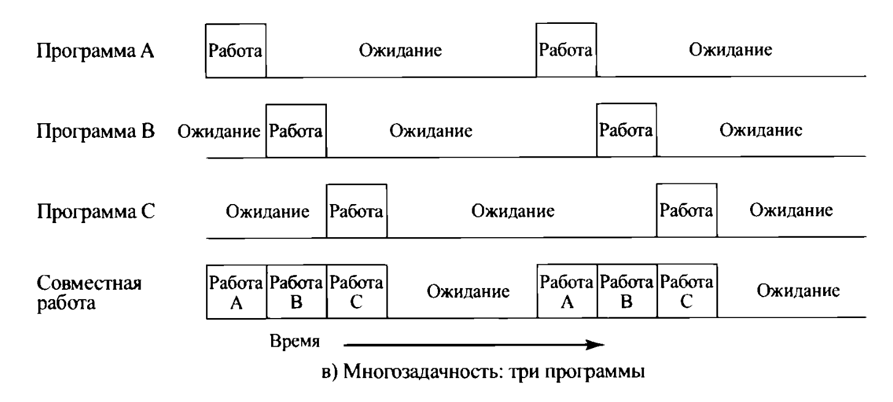

Но тоже нужно прнимать, что все так радужно будет работать, только если используется не одно ВУ на всех, а каждая программа использует свой принтер например. Иначе ожидания будут просто складываться - это конечно тоже увеличит эффективность, но не так значительно.

Короче да, тут уже появляются нормальные прерывания, придумываются уже какие-то более серьезные механизмы управления памятью (чтобы эта схема эффективно работала, все таки все "параллельно" выполняющиеся задачи должны быть в памяти одновременно. Иначе, если одна задача заблокировалась бы (условно) на IO, то выгружать ее и загружать другую это уже столько времени, что IO может быть и закончился бы уже у этой задачи). Так же должен быть уже какой-то механизм диспетчеризации, так как операционной системе нужно уметь резолвить, какую задачу запустить, если готовы к исполнению уже несколько.

### Системы с разделением времени

Тут уже решили вообще убрать операторов и просто взять компьютер и подсоединить к нему какое-то количество терминалов, за которые посадить пользователей. И они сами уже будут с помощью команд загружать и исполнять свои программы. Таким образом реализуется многопользовательсий интерактивный режим работы. В таком случае каждый пользователей (всего - n пользователей) получает в среднем 1/n процессорного времени (без учета работы операционной системы).

По таймеру каждые условно 0.2 секунды генирировалось прерывание, управление передавалость ОС, которая могла диспетчеризовать на процессор другого пользователя. Такая технология получила название <u>**квантование времени**</u>. Тут уже появляются проблемы защиты пользовательских файлов друг от друга (права доступа).


## Основные направления в ОС

В процессе развития операционных систем были проведены исследования в четырех основных направлениях:
- процессы
- управление памятью
- защита информации и безопасность
- планирование и управление ресурсами

В основном развитие современных операционных систем происходит по перечисленным выше направлениям. Поэтому краткий обзор:

### Процессы

Процессы - одна из основополагающий концепций в ОС. Впервые появилась в ОС Multics (вроде как предшественник unix).

Одни из многих определений термина **процесс**:
- Процесс (по стандарту ISO) - совокупность взаимосвязанных и взаимодействующих операций, преобразующих входящие данные в исходящие.

- Процесс (с точки зрения пользователя) - экземпляр программы <u>во время ее исполнения</u>.

- Процесс (с точки зрения ОС) - единица активности ОС, в которой существуют последовательные действия, текущее состояние и набор связанных ресурсов.

Кстати: поток - единица потребления <u>процессора</u> у процесса.

#### Проблемы современных процессов

Когда в системе выполняется "одновременно" много процессов, которые выполняют длинные последовательности различных действий (что-то считают, обращуются к памяти, обращаются к ВУ и тд), и нужно их постоянно переключать, то может возникнуть большое количество трудноуловимых ошибок. Имеется в виду, что действия всех процессов "дробятся" на маленьких части и "смешиваются" в практически случайные последовательности во времени, в зависимости от того, как операционная система будет их диспетчеризовать. И из-за того, что всевозможные комбинации действий, которые могут получиться, невозможно предсказать, могут происходить всякие неожиданности:

- неправильная синхронизация
Если процессы работают одновременно и как-то взаимодействуют друг с другом, то могут возникать проблемы синхронизации, например:

```
process A:
    check condition
    sleep()

process B:
    set condition
    wakeup(A)
```

Если действия процесса B выполнятся между check condition и sleep() процесса A, то процесс A например может никогда не проснуться.

- сбой взаимного исключения
Если несколько процессов используют один и тот же ресурс тоже могут возникать проблемы. Например если два процесса одновременно изменяют файл. Для корректной работы нужен какой-то механизм взаимного исключения, который будет позволять в каждый момент времени обновлять файл только одной программе.

- Недетерминированное поведение программы
По идее, уже вроде как знаем как решать, но все же. Ни один процесс не должен мочь испортить другой процесс, случайно записав что-нибудь куда-нибудь не в свою память.

- Взаимные блокировки (как на уровне тредов так и на уровне процессов)
  - deadlocks (обоим процессам нужно занять по два каких-то ресурса, которые им нужны для работы (A и B). Один процесс захватывает ресурс A, другой процесс захватывает ресурс B, и они оба пытаются перекрестно достучаться до вторых ресурсов, и при этом ждут на блокировке)
  - livelocks (я так понял плюс минус то же самое, что и deadlock, но разница в том, что в deadlock процессы обычно не потребляют CPU, они просто ждут на блокировках. В lifelock они оба в цикле проверяют ресурс и потребляют процессор)
  - starvation (когда поток долго или вообще никогда не получает доступ к какому-то ресурсу. Например у потока A высокий приоритет и он всегда готов к выполнению. Тогда планировщик всегда будет запускать поток A, а поток B не получит процессорное время)

####

Процесс можно условно разделить на 3 части:
- выполняющийся код (программа)
- данные, необходимые для ее работы (переменные, буферы и тд)
- контекст выполнения

<u>**Контекст выполнения**</u> или <u>**состояние процесса**</u> включает в себя всю информацию, нужную ОС для управления процессом и процессору для его выполнения. Сюда входит содержимое регистров процессора, приоритет процесса, сведения о том, находится ли данный процесс в ожидании какого-то события и тд.

Ниже рассмотрена примитивная модель организации процессов в ОС, пока непонятно, насколько она далека от правды:

Операционная система хранит список всех процессов, элемент списка содержит указатель на область памяти, где размещен процесс, и сюда же может частично или полностью включаться контекст самого процесса, а остальная часть контекста лежать в самом процессе (потому что например состояния регистров наверное не учавствуют в диспетчеризации и в принципе не особо нужны самой ОС, поэтому можно их засунуть внутрь процесса, так как использоваться они будут только при восстановлении состояния процессора).

В регистре индекса процесса содержится индекс выполняющегося в текущий момент времени процесса, идентифицирующий его в списке процессов. **Базовый и граничный** регистры задают область памяти, занимаемую процессом.

В базовый регистр заносится адрес начальной ячейки этой области, а в граничный
размер (в байтах или словах). Содержимое счетчика команд и всех ссылок на данные
отсчитывается от значения базового регистра (что защищает процессы от воздействия друг на друга).

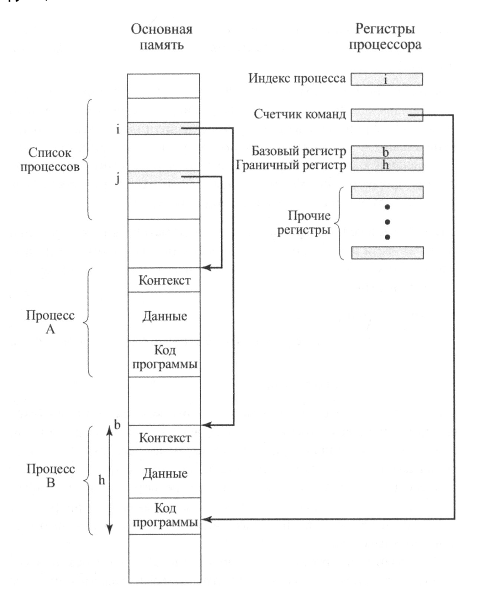


### Управление памятью

В рамках управления памятью ОС должна уметь реализовывать вот такие функции:
- изоляция процессов
Ни один процесс не должен мочь испортить память другого процесса.
- автоматическое размещение и управление
Программы должны динамически размещаться в памяти. И это размещение должно быть прозрачным для программиста.
- поддержка модульного программирования
ОС должна позволять программам динамически создавать и управлять частями своей памяти. Тут имеются в виду и динамические библиотеки и динамический размер хипа например.
- защита и контроль доступа
Тут не совсем про то, что и первый пункт. Тут скорее про контролируемое совместное использование памяти. В рамках оперативной памяти это может быть shared memory. Два процесса работают с одной областью памяти, но ос проверяет
  - кто создал
  - кто имеет право читать
  - кто имеет право писать
В рамках вторичной памяти это про доступ к файлам (права доступа).
- долгосрочное хранение
Многим приложениям требуются средства, с помощью которых можно было бы хранить информацию в течение длительного времени после выключения компьютера.

Обычно ОС выполняют эти требования с помощью средств виртуальной памяти и файловой системы.

Файловая система обеспечивает долгосрочное хранение информации, помещаемой в именованные объекты, которые называются файлами. Файл это удобная для программиста концепция, доступ к которой и защита которой осуществляются операционной системой.

#### Виртуальная память

Механизм виртуальной памяти позволяет программисту рассматривать память в логическом смысле, не задумываясь о фактическом размере физической памяти и о том, как будут по факту размещен процесс в этой памяти.

Оказалось, что и физическую и виртуальную память удобно разбить на небольшие блоки фиксированного размера. В виртуальной памяти - это страница, в физической - это фрейм. По размеру маппинг 1 к 1.

Обращение программы к слову памяти происходит по **виртуальному адресу**, который представляет из себя номер страницы и смещение относительно ее начала. По идее эта структура виртуального адреса должна быть даже незаметна (но в зависимости от размера страницы по идее). Но в лучшем случае это может выглядеть так:

```
0000 # стр 0 смещение 1
0001 # стр 0 смещение 2
...
0100 # стр 1 смещение 0
0101 # стр 1 смещение 1
...
1100 # стр 3 смещение 0
```

Страницы одного процесса в общем случае хаотично разбросаны по основной памяти, а часть вообще может быть выгружена на диск. Ну или на самом деле можно не выгружать на диск а просто удалить, если например это readonly сегмент кода, ведь потом эту же страницу можно будет загрузить из исполняемого файла. Некоторые страницы могут быть невыгружаемыми. Например, если страница используется многими процессами.

Когда происходит обращение к памяти, адрес проходит через модуль преобразования виртуального адреса в физический (какое-то количество таблиц, MMU, TLB и все такое) и на выходе получается реальный адрес.

####

Файлы хранятся на долговременном запоминающем устройстве. Чтобы с ними могли работать программы, файлы или их фрагменты могут копироваться в виртуальную память.

### Защита информации и безопасность

Если говорить в общих чертах, мы сталкиваемся с проблемой контроля над доступом к компьютерным системам и хранящейся в них информации. Большую часть задач по обеспечению безопасности и защиты информации можно условно разбить на четыре категории:

- доступ к системе (защита от несанкционированного доступа)
- конфиденциальность (невозможность прочитать данные неавторизованным пользователем)
- целостность данных (невозможность изменить данные неавторизованным пользователем)
- Аутентификация - проверка идентичности пользователя (проверка что пользователь это именно тот за кого себя выдает)

для справки: авторизация - проверка прав.

### Планирование и управление ресурсами

Одной из важных задач операционной системы является управление имеющимися в
ее распоряжении ресурсами, а также планирование их использования между разными активными процессами. При разработке стратегии планирования и управления нужно принимать во внимание следующие факторы:

- равноправность
Обычно желательно, чтобы всем процессам, претендующим на какой-то определенный ресурс, предоставлялся к нему одинаковый доступ.
- дифференциация отклика
С другой стороны, может понадобится, чтобы система по разному относилась к разным процессам. Например, если есть интерактивный процесс, с которым непосредственно в данный момент работает пользователь, он должен отвечать быстрее. Соответственно имеет смысл ввести некоторые приоритеты.
- эффективность
ОС должна сводить к минимуму время отклика системы и максимально эффективно распределять и управлять ресурсами.

Эти требования немного противоречат друг другу и насущной проблемой исследования операционных систем является поиск нужного соотношения в каждой конкретной ситуации.

#### Основные элементы, участвующие в планировании процессов и распределении ресурсов

Операционная система поддерживает несколько очередей, каждая из которых является просто
списком процессов, ожидающих своей очереди на использование какого-то ресурса.
В <u>краткосрочную очередь</u> заносятся процессы, которые (или по крайней мере основные
части которых) находятся в основной памяти и готовы к выполнению. Выбор очередного
процесса осуществляется <u>краткосрочным планировщиком</u>, или <u>диспетчером</u>. Общая стратегия состоит в том, чтобы каждому находящемуся в очереди процессу давать доступ по очереди; такой метод называют циклическим (round-robin). Кроме того,процессам можно присваивать различный приоритет.

В <u>долгосрочной очереди</u> находится список новых процессов, ожидающих возможности
использовать процессор. Операционная система добавляет их в систему, перенося из
долгосрочной очереди в краткосрочную. В этот момент процессу необходимо выделить
определенную часть основной памяти. Таким образом, операционная система должна
следить за тем, чтобы не перегрузить память или процессор, добавляя в систему слишком
много процессов. К одному и тому же устройству ввода-вывода могут обращаться
несколько процессов, поэтому для каждого устройства создается своя очередь.

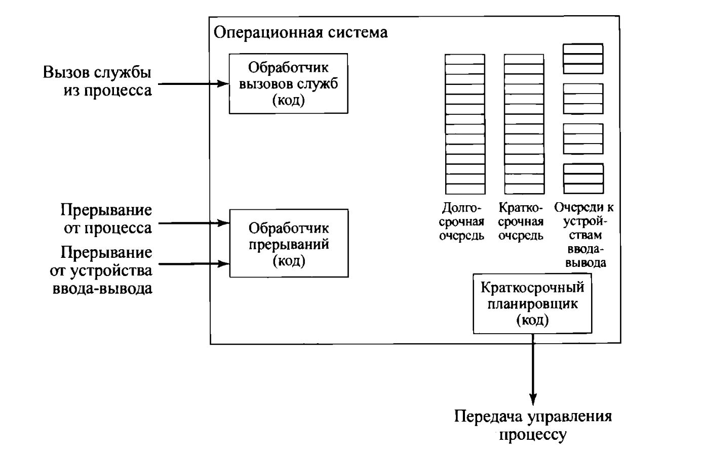

## Эксперементы с ОС

Ввиду развития аппаратного обеспечения, программного обеспечения, появления уязвимостей и новых требований, помимо совершенствования архитектуры операционных систем, стало иметь место быть появление новых подходов к организации операционных систем. Эти подходы можно объединить в следующие категории:

- архитектура ядра
- многопоточность
- симметричное мультипроцессирование

### Архитектуры ядер

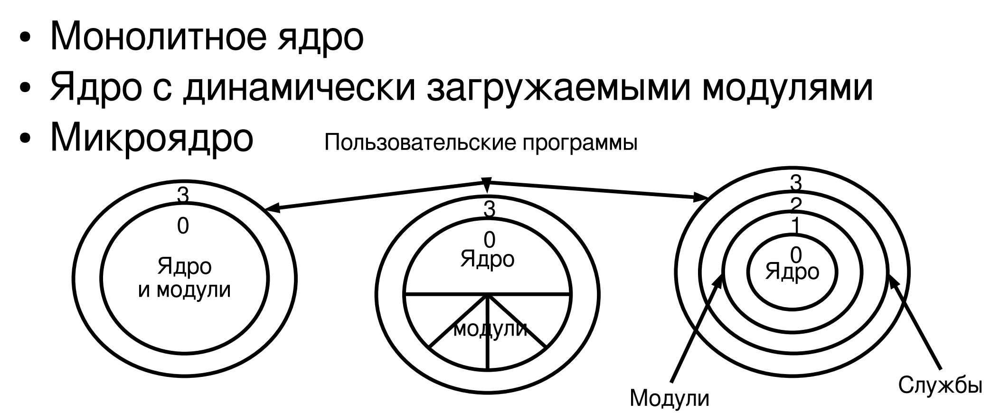

- Монолитное ядро. Сейчас обычно используется только во встроенных системах. Ничего динамически не подгрузить. Скомпилировали, загрузили в основную память, она работает. Если нужно что-то поменять, добавить какой-нибудь модуль, то придется перекомпилировать и заново загружать. Вся операционная система, помимо всяких утилиток сосредоточена в ядре.
- Ядро с динамически загружаемыми модулями. Как на всех персональных компьютерах общего назначения. Вспомним ту же загрузку новых драйверов устройств например. То есть все еще есть область в основной памяти где лежит ядро, но эту область можно динамически расширять и "дописывать" функциональность.
- Микроядро. Суть в том, чтобы в само ядро выделить какие-то самые базовые штуки типа управления процессами и памятью. А остальные подсистемы типа драйверов или файловой системы сделать отельными процессами. И на самом деле это дает большой плюс, поскольку какой-нибудь кривой драйвер не уронит всю ОС, но по итогу оказалось что слишком частое переключение контекстов режим ядра <-> userspace тормозит систему, и от этой идеи практически отказались. Имеется в виду, что чтобы например прочитать что-то из файла то придется сделать userspace (syscall) -> kernel -> filesystem (syscall) -> kernel -> driver (syscall) -> kernel -> hardware, короче ппц.

### Многопоточность

Поскольку создание процесса очень дорогая штука, то в рамках одного процесса придумали потоки. По сути поток это сохраненное состоянии регистров вот и все (TODO нет не все, еще отдельный стек и еще может быть что-то). Их так же можно диспетчеризровать на разные процессоры.

Грин треды - потоки в юзер спейсе.

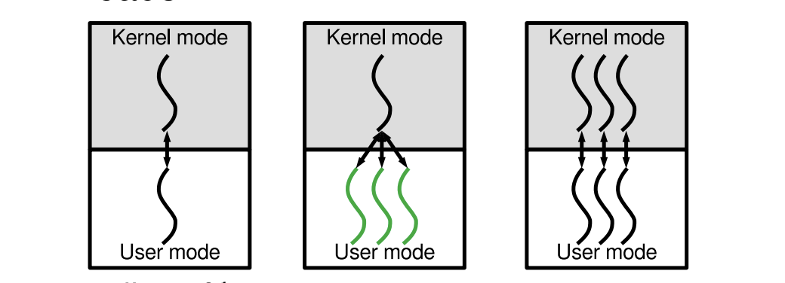

### SMP

Рассказывал где-то выше.

## Отказоустойчивость


REWRITE THIS vvv

## Виртуализация

TODO Ниче особо непонятно конкретного. Разобраться.

# 1-6. Основные понятия надежности операционных систем

## Отказоустойчивость

Способность продолжать работу при аппаратных или программных ошибках

- избыточность аппаратуры (двойное, тройное резервирование)
- обеспечение возможности аппаратной "горячей" замены компонентов
- Организация уровней хранения RAID (Redundunt Array of Inexpensive Disks) в дисковой подсистеме.

TODO не понял че за RAID

##
Ну тут всякая хрень из ОПИ я не стал записывать.

## Диспетчеризация процессов в простом приближении:

Обычно процессорное время делится исходя из приоритета процесса. От него зависит то, как часто таймер будет прерывать тот или иной процесс (размер кванта времени для процесса).

Текущий процесс сменяется если:
- истек квант времени (прервал таймер и запустился диспетчер процессов)
- процесс ждет IO операцию

## Состояния процесса в контексте диспетчеризации

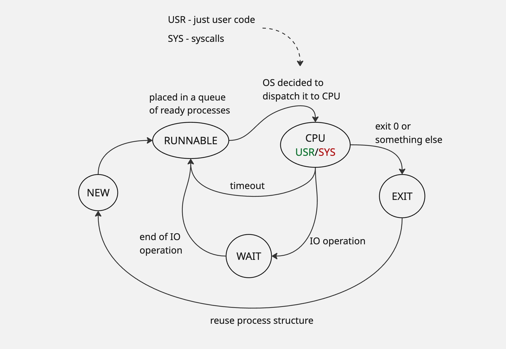

### NEW

- выделяются ресурсы: PCB (Process Control Block - блок управления процессом), адресное пространство, записи в таблицах ОС
- загружается исполняемый код в память
- настраиваются начальные параметры (стек, регистры, файловые дескрипторы)

PCB - это структура данных с огромным количеством разных полей, таких как PID, state (NEW, RUNNING ...), значения регистров, таблицы страниц, приоритет и тд.

### WAIT (blocked)

Процесс ждет наступления какого-то события или освобождения ресурса.

Причины перехода в WAIT:
- ожидание ввода-вывод
- ожидание синхронизации (процесс заблокирован на мьютексе или другом примитиве синхронизации)
- ожидание события (ждет сообщения, таймер, еще че-нибудь)
- ожидание освобождения ресурса 

Когда процесс переходит в WAIT, ОС помещает его в очередь, связанную с определенным ресурсом или событием (например в очередь где все ждут освобождения одного мьютекса). Из очереди процессы попадают обратно в READY (RUNNABLE).

###

С остальными состояниями вроде все понятно.

# 2.1 Пейджинг и своппинг

Пейджинг (Paging) - выгрузка (загрузка) неиспользуемых страниц процесса на диск.

Своппинг (Swapping) - выгрузка (загрузка) процесса целиком (кроме каких-то важных для ядра структур управления).

Своппинг сейчас практически не используется. Процессы весят слишком много, и полная выгрузка будет занимать очень много времени.

Страница, состоящая фул из команд, может быть просто удалена, а потом заново загружена, ведь там нет никакого состояния.

## 7 состояний процесса

С появлением пейджинга/своппинга появляется еще два состояния процесса:

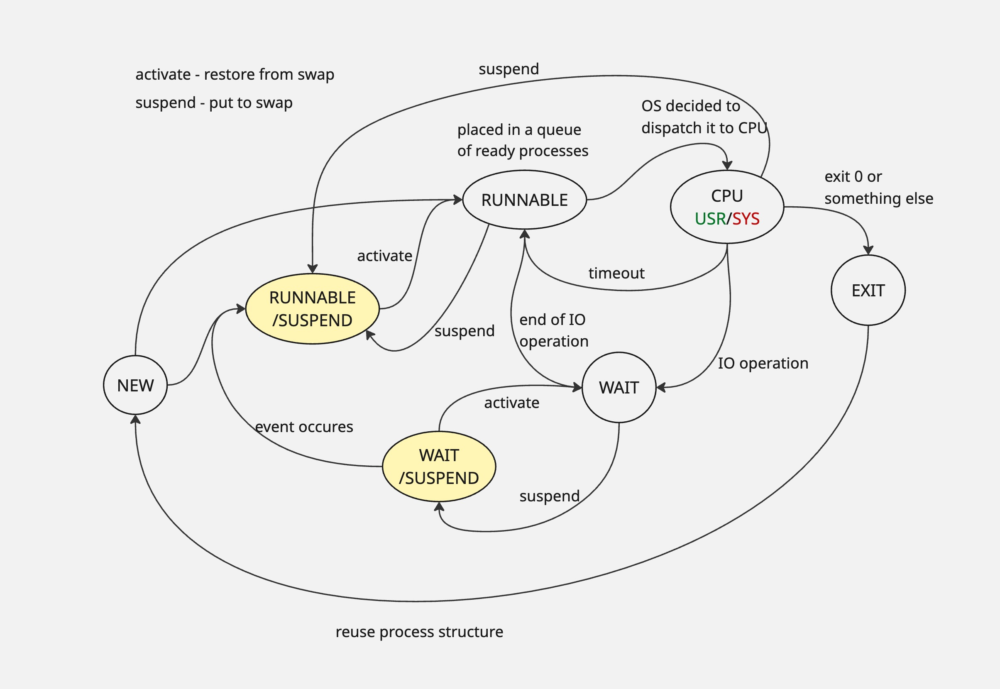

В принципе все логично, но иногда может быть непонятна логика, с которой ОС из разных состояний переносит процесс в своп и обратно, но в общем:

- процесс может попасть в своп, если "слишком долго ждет". Например, событие долго не происходит, и страницы, без которых процесс не может продолжить выполнение выгружаются в своп. Тогда он получает пометку suspended к своему состоянию.
- процесс может выйти из WAIT /SUSPEND, наверное, если, например, все остальные процессы убились и освободилось достаточно памяти.
- если процесс в WAIT /SUSPEND, и наконец происходит нужное событие, то процесс становится RUNNABLE /SUSPEND.
- из RUNNABLE /SUSPEND, когда подходит очередь процесса исполняться, нужные страницы вытаскиваются из свопа, он становится просто RUNNABLE и помещается на CPU.
- но и из RUNNABLE процесс может быть отправлен в своп, наверное, если, например появляется слишком много других процессов в очереди с более высоким приоритетом или что-нибудь такое.

Есть еще две наиболее загадочные стрелочки NEW -> RUNNABLE /SUSPEND и CPU -> RUNNABLE /SUSPEND.

- NEW -> RUNNABLE /SUSPEND. Когда процесс создается, иногда имеет смысл его поскорее "создать", а дальше перекинуть всю ответственность на своп. Например, просто не заполнить сегмент кода, и сказать что процесс готов. Как-то так вроде.
- CPU -> RUNNABLE /SUSPEND. Тут видимо про то, что память может жестко переполнится или что-то еще может случиться, что ос впадет в панику и начнет "отстреливать" процессы прям с CPU.

P.S. Paging/Swapping оказывается не единственные причины почему процесс может быть приостановлен (suspended). Можно например его руками остановить (командой пользователя) и еще много почему. 

# 2.3 Управление процессами

Показали дамп виртуальной памяти процесса и рассказали про PCB

## Создание процессов в общем

- присвоить процессу уникальный идентификатор
- выделить память для процесса
- инициализировать PCB
- Поставить процесс в очереди ядра
- Создать потоки ввода-вывода (stdin stdout stderr)
- Создать другие управляющие структуры данных

##

Процесс может работать в user и kernel mode. Kernel mode это syscall'ы, прерывания и тд.

Показали каринку с юниксовыми с состояниями процесса, но у меня уже есть таких две картинки, так что ладно уже.

Показали усеченное дерево структур юниксовых процессов.

# 2.4 Потоки

Процесс - единица группировки общжих ресурсов.

Поток - единица выполнения программного кода.
Содержит:
- Состояние выполнения
- Сохраненный контекс потока (регистры...)
- Стек (ядра и пользователя)
- Локальные переменные
- Доступ к памяти и другим ресурсам процесса-владельца

Так же существует управляющий блок потока.

## Приемущество потоков

- Потоки создаются на порядок быстрее
- Потоки переключаются быстрее
- Потоки завршаются быстрее
- Потоки могут обмениваться информацией быстрее (без участия ядра)

Даже в однопроцессорной системе есть приемущества:
- Работа в приоритетном и фоновом режиме
- Асинхронная обработка частей программы
- Модульная структура программы
